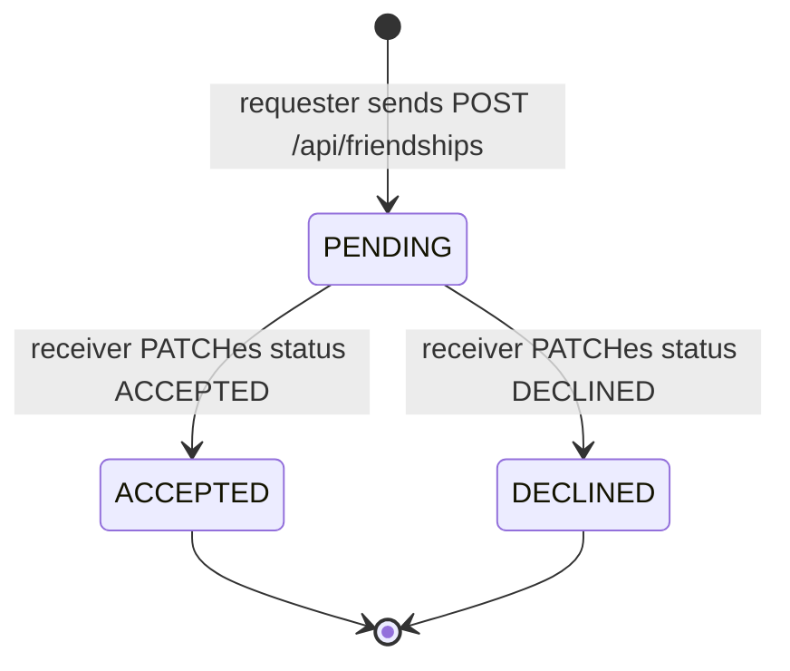

# A user can send a friend request, and the receiver can accept or decline it

## Why
Friendship decides who sees `FRIENDS` and `CLOSE_FRIENDS` posts. Before two
people are friends, one asks and the other answers; nobody becomes someone's
friend without agreeing to it.

## Where it lives
- `packages/db/prisma/schema.prisma` — `Friendship` model, unique `(requesterId, receiverId)`
- `packages/db/prisma/migrations/0002_friendships.sql`
- `packages/domain/src/friendships.ts` — schemas, `sendFriendRequest`, `respondToFriendRequest`
- `apps/web/app/api/friendships/route.ts` — `POST /api/friendships`
- `apps/web/app/api/friendships/[id]/route.ts` — `PATCH /api/friendships/:id`

## Behavior



- There is at most one `Friendship` row between any two users, whichever of
  them sent it.
- `POST /api/friendships` with `{ receiverId }` creates a `PENDING` request
  from the current user and returns `201 { friendship }`.
  - `receiverId` missing, not a uuid, or the body not JSON → `400 VALIDATION_ERROR`.
  - `receiverId` is the current user → `400 VALIDATION_ERROR`.
  - `receiverId` is unknown or a deactivated user (`isActive = false`) → `404 NOT_FOUND`.
  - A row already exists between the two users, in either direction and in
    any status → `409 CONFLICT`. Nothing is written.
- `PATCH /api/friendships/:id` with `{ status: "ACCEPTED" | "DECLINED" }`
  moves a `PENDING` request to that status, sets `respondedAt`, and returns
  `200 { friendship }`.
  - Only the receiver can respond. For the requester, any other user, or an
    unknown id → `404 NOT_FOUND`, and nothing changes.
  - The request is no longer `PENDING` → `409 CONFLICT`; the first answer stands.
  - `id` not a uuid, or `status` anything else (including `PENDING` and
    `BLOCKED`) → `400 VALIDATION_ERROR`.
- The acting user is always `currentUserId()`; ids in the body never name
  the actor.
- Unexpected failures return `500 INTERNAL_ERROR` and are logged; raw errors
  never reach the client. Errors use `{ error: { code, message } }`.

## Examples

| State / input | Behavior |
|---|---|
| Alice `POST`s `{ receiverId: bob }` | `201`, `PENDING` from Alice to Bob |
| Alice `POST`s the same request again | `409 CONFLICT`, still one row |
| Bob `POST`s `{ receiverId: alice }` while Alice's request is pending | `409 CONFLICT` |
| Alice `POST`s `{ receiverId: alice }` | `400 VALIDATION_ERROR` |
| Alice `POST`s to a deactivated or unknown user | `404 NOT_FOUND` |
| Bob `PATCH`es `{ status: "ACCEPTED" }` | `200`, status `ACCEPTED`, `respondedAt` set |
| Alice (the requester) or Carol `PATCH`es it | `404 NOT_FOUND`, still `PENDING` |
| Bob declines, then `PATCH`es `ACCEPTED` | `409 CONFLICT`, stays `DECLINED` |
| Alice re-sends after Bob declined | `409 CONFLICT` |

## Verify
- `pnpm test` runs `tests/integration/friendships.test.ts`.
- With `pnpm dev` running and two users in the database:

  ```bash
  curl -s -X POST localhost:3000/api/friendships -H 'x-user-id: <alice>' \
    -H 'content-type: application/json' -d '{"receiverId":"<bob>"}'
  curl -s -X PATCH localhost:3000/api/friendships/<id> -H 'x-user-id: <bob>' \
    -H 'content-type: application/json' -d '{"status":"ACCEPTED"}'
  ```

  Repeating the `PATCH` with `x-user-id: <alice>` returns `404`.

## Constraints & decisions
- `ACCEPTED` and `DECLINED` are final. Re-requesting after a decline,
  unfriending, and blocking are not built, so the `BLOCKED` status is never
  written yet.
- The PATCH changes status only when the row is still `PENDING`, checked in
  the same `UPDATE`, so two concurrent answers can't both succeed.
- The send path checks both directions before inserting. The unique index
  only covers one direction, so two users who request each other at the same
  instant can end up with two rows; this is accepted until it matters.
- No notification is written. `NotificationType.FRIEND_REQUEST` and
  `FRIEND_ACCEPTED` exist, but there is no `Notification` model yet.

## Out of scope
- Listing friends or pending requests: not specified yet.
- Using friendship for post visibility (`FRIENDS`, `CLOSE_FRIENDS`): owned
  by the post specs; not specified yet.
- Notifications for requests and acceptances: not specified yet.
