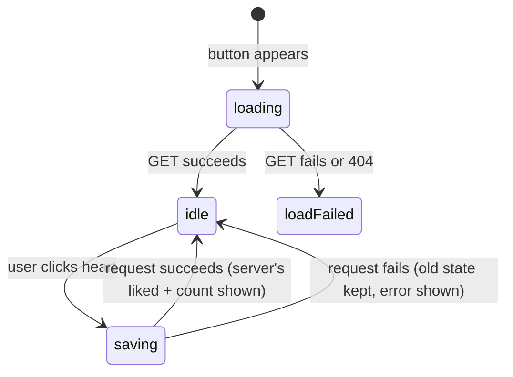

# The like button shows a post's like state and toggles it

## Why
A viewer sees at a glance whether they've liked a post and how many likes
it has, and can like or unlike it with one tap.

## Where it lives
- `apps/web/components/LikeButton.tsx` — the client component
- Calls `GET`, `POST` and `DELETE` on `/api/posts/[postId]/likes` (spec: `docs/specs/posts/likes.md`)

## Behavior

- **loading**: shows "Loading likes…" while it fetches the current state.
- **loadFailed**: shows "Likes unavailable". There is no retry button.
- **idle**: shows a filled heart (♥) if the viewer liked the post, an empty
  heart (♡) if not, and the like count.
- **saving**: sends `POST` (to like) or `DELETE` (to unlike). The button is
  disabled so a double-click can't send two requests.
- After a successful save, the heart and count come from the server's
  response, not from adding or subtracting 1 in the browser.
- After a failed save, the heart and count stay as they were and an error
  message appears. The next click clears it.
- If the `postId` prop changes, the button goes back to **loading**.

## Examples

| State / input | Behavior |
|---|---|
| Post has 3 likes, viewer hasn't liked it | ♡ 3 likes |
| Viewer clicks ♡ and the server answers `{ liked: true, count: 4 }` | ♥ 4 likes |
| Viewer clicks ♥ and the request fails | ♥ stays, count unchanged, error shown |
| Viewer double-clicks quickly | One request; the button is disabled while saving |
| The post is private to someone else (API returns 404) | "Likes unavailable" |
| Count is 1 | "1 like" (singular) |

## Verify
- `pnpm typecheck` passes.
- With `pnpm dev` running, place `<LikeButton postId="<a real post id>" />` on
  a page, click the heart, refresh, and check the state persisted.
- Keyboard pass: Tab to the heart and press Enter or Space to toggle it.

## Constraints & decisions
- `liked` and `count` are stored once, in a single `like` object from the
  server. `isSaving`, the heart icon and the label are derived from state on
  each render, never stored separately, so they can't fall out of sync.
- No optimistic update: the UI waits for the server's answer. This keeps the
  count correct when other people like the post at the same time.

## Out of scope
- Where the button appears (post card, post page): owned by those components.
- Showing who liked a post: not specified yet.